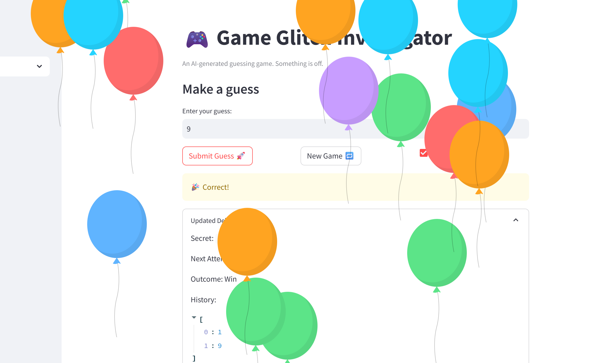

# 🎮 Game Glitch Investigator: The Impossible Guesser

## 🚨 The Situation

You asked an AI to build a simple "Number Guessing Game" using Streamlit.
It wrote the code, ran away, and now the game is unplayable. 

- You can't win.
- The hints lie to you.
- The secret number seems to have commitment issues.

## 🛠️ Setup

1. Install dependencies: `pip install -r requirements.txt`
2. Run the broken app: `python -m streamlit run app.py`

## 🕵️‍♂️ Your Mission

1. **Play the game.** Open the "Developer Debug Info" tab in the app to see the secret number. Try to win.
2. **Find the State Bug.** Why does the secret number change every time you click "Submit"? Ask ChatGPT: *"How do I keep a variable from resetting in Streamlit when I click a button?"*
3. **Fix the Logic.** The hints ("Higher/Lower") are wrong. Fix them.
4. **Refactor & Test.** - Move the logic into `logic_utils.py`.
   - Run `pytest` in your terminal.
   - Keep fixing until all tests pass!

## 📝 Document Your Experience

- [x] **Game purpose:** A Streamlit number-guessing game where the player tries to guess a secret number within a limited number of attempts, guided by "Higher/Lower" hints and scored by efficiency.
- [x] **Bugs found:**
  1. **State bug** — The secret regenerated on every button click because `random.randint()` ran outside `st.session_state`.
  2. **Hint logic bug** — "Go Higher/Lower" hints were inverted.
  3. **Type glitch bug** — On even attempts, the secret was cast to `str`, breaking numeric comparison.
  4. **New Game bug** — The button didn't fully reset game state.
- [x] **Fixes applied:**
  1. Store the secret in `st.session_state.secret`, initialized only once.
  2. Swap hint messages in `check_guess()` so direction matches the guess.
  3. Remove the odd/even `str()` cast — always pass an integer secret.
  4. Reset all session state keys and call `st.rerun()` in the New Game handler.

## 📸 Demo

- 

## 🚀 Stretch Features

- [ ] [If you choose to complete Challenge 4, insert a screenshot of your Enhanced Game UI here]
